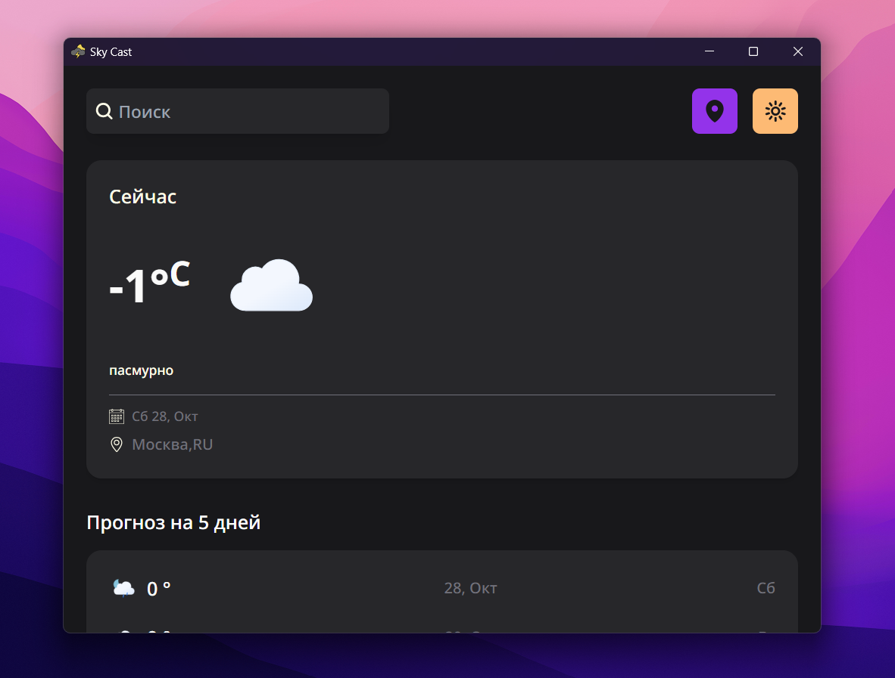

# ☔ Sky Cast

A weather app builded with Vue & Tauri



## 📦 Stack

- [TypeScript](https://www.typescriptlang.org/): A typed JavaScript

- [Vue](https://vuejs.org/): A performant and versatile JavaScript framework for building web user interfaces

- [Vite](https://vitejs.dev/): A fast build tool

- [Pinia](https://pinia.vuejs.org/): A light,intuitive store for Vue.js

- [TailwindCSS](https://tailwindcss.com/): A CSS framework for building UI

- [Tauri](https://tauri.app/): A framework for building cross-platform desktop apps using HTML, JS, and CSS

## ✨ Recommended IDE Setup

- [VS Code](https://code.visualstudio.com/) + [Volar](https://marketplace.visualstudio.com/items?itemName=Vue.volar) + [Tauri](https://marketplace.visualstudio.com/items?itemName=tauri-apps.tauri-vscode) + [rust-analyzer](https://marketplace.visualstudio.com/items?itemName=rust-lang.rust-analyzer)

## 🚀 Get Stated

```sh
git clone https://github.com/Killitar/sky-cast.git
cd sky-cast
pnpm install
pnpm tauri dev
```

## Authors

Miroslav([@killitar](https://github.com/Killitar))

kokos([@kokos](https://github.com/kokos1kkk))
